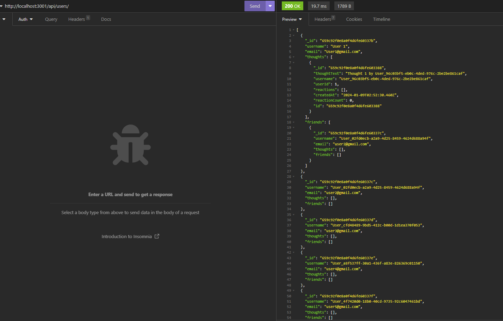

# Social Network API
    
## Description:

-This project showcases an API, that has users, who have thoughts. Thoughts have reactions and Users can have Friends who are other Users.
    
## Table of Contents:

- [Description](#description)
- [Installation](#installation)
- [Usage](#usage)
- [Credits](#credits)
- [License](#license)
- [Tests](#tests)
- [Questions](#questions)

## Installation:

To install and run this project, you will need to run seeds and npm i, and node index.js

## Usage:

To intereact use Insomnia to Create Get, Post, Put and Delete requests

## Credits:

Cody Thompson

## License:

n/a

## Tests:

No Tests.

## Questions:

Contact Information

Github Link: https://github.com/codyleight

Video Link: https://drive.google.com/file/d/1CoB3baRRIcCepHyZkFAL1u1SspAYFfky/view

Email: codylthomp@gmail.com

Screenshot of a CRUD request:
